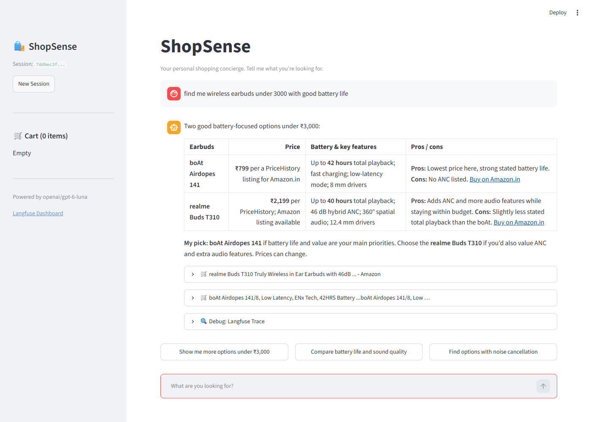
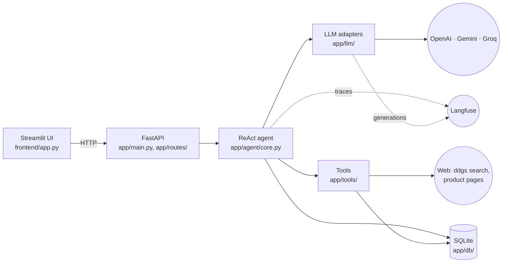
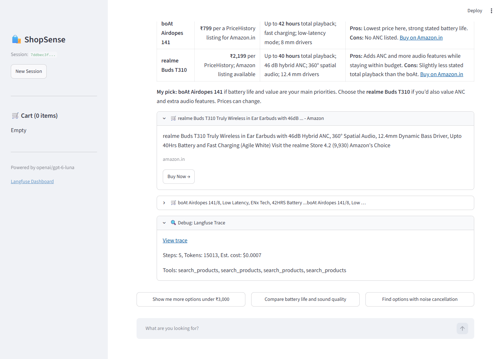
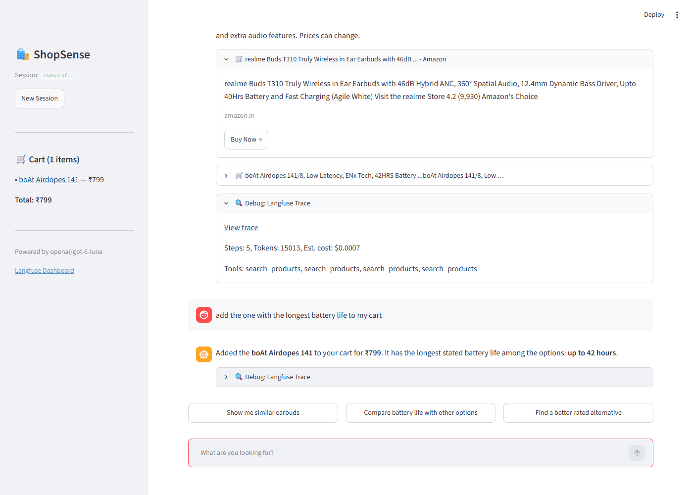

# ShopSense

A personal shopping concierge. Tell it what you're looking for ("wireless earbuds under ₹3,000 with good battery"), and it searches the web, reads product pages, compares options, and answers with specific products, sourced prices and buy links. It keeps a cart, remembers your preferences, and learns about you across chats, which you can see and delete. Every turn is traced in [Langfuse](https://langfuse.com), so you can see exactly what the agent did and why.



**Stack:** Python 3.12 · FastAPI · a ReAct agent with an OpenAI-compatible LLM layer (OpenAI by default; Gemini and Groq by config) · web search via `ddgs` · SQLite · Streamlit · Langfuse.

## Contents

- [What it does](#what-it-does)
- [Architecture](#architecture)
- [Quick start](#quick-start)
- [Example conversation](#example-conversation)
- [Tech stack, and why](#tech-stack-and-why)
- [Design patterns](#design-patterns)
- [How to add a new tool](#how-to-add-a-new-tool)
- [How to swap LLM providers](#how-to-swap-llm-providers)
- [Configuration](#configuration)
- [API](#api)
- [Development](#development)
- [Security](#security)
- [More documentation](#more-documentation)

## What it does

- **Researches, not guesses.** The agent searches first, runs targeted searches for promising models, and reads product pages when it needs details. It recommends specific products with the price and the store it found them in. It never invents prices or links.
- **Six tools:**
  - `search_products`: web search.
  - `extract_product_info`: reads a product page's structured data.
  - `compare_products`: builds a comparison table.
  - `manage_cart`: adds, removes and clears items. "Add that one" adds the product it already showed you, with no new search.
  - `manage_preferences`: remembers brands, sizes and your usual budget, across sessions.
  - The current cart, budget and preferences are always in the agent's context, so it never needs a tool call to look them up.
  - `set_budget`: "under 5k" or "my budget is 3000" sets the budget for this conversation. The sidebar shows it, and every later recommendation stays within it.
- **Shopping only, with tools only when needed.**
  - Greetings and thanks get a short reply.
  - Off-topic requests (weather, coding, news, advice) get a polite "I can only help with shopping".
  - Personal or upsetting messages get a kind reply, with no sales pitch and a pointer to people who can help when someone seems at risk.
  - Illegal items are declined.
  - Questions about what it already knows (your cart, your budget, products it just showed) are answered without new tool calls.
  - `evals/scope.py` checks 28 such edge cases.
- **Prices are checked on the store before you see them.**
  - Each product link in an answer is fetched (Flipkart, Amazon.in, and stores that publish product data), and the price beside it is compared to the rupee.
  - A wrong price is corrected, with a note; an out-of-stock product is flagged.
  - Each product card says whether its price was checked ("✓ ₹1,949 · price checked on amazon.in just now") or came only from search results.
  - The agent rarely invents prices. Wrong prices came from stale or second-hand search snippets; see [ADR 0007](docs/adr/0007-live-price-check.md).
- **Remembers you across chats.**
  - After each answer, it learns lasting facts from what *you* said: brands you avoid, sizes, your usual spend, how you use things. One-off requests like "earbuds under 3000" aren't stored.
  - When you change your mind ("boAt is fine now"), the old fact is replaced, not kept beside the new one.
  - Each chat is summarized when you start a new one, or in the background if you just closed the tab.
  - New chats see the strongest facts and the latest summaries, framed as possibly outdated notes, never instructions.
  - **Settings shows all of it as markdown files,** each editable with an "Updated …" time:
    - `user.md`: about you, in your own words (name, what to call you, pronouns, notes). Only you write it.
    - `memory.md`: learned facts under headings. Delete a line to make it forget, or add your own.
    - `preferences.md`: saved preferences.
    - `YYYY-MM-DD.md`: each day's chat summaries, on the day the chat happened in your time zone.
  - It never learns from web pages or its own answers, so a planted page can't become a lasting memory. See [ADR 0008](docs/adr/0008-long-term-memory.md).
- **All your chats in the sidebar.**
  - Every past chat is listed, most recently active first, with a short title (made from your first message) and when you last used it ("2 hr ago", "Yesterday", "24 Sep").
  - Click one to pick it up where you left off. Search titles, rename a chat, or delete it (with a confirmation).
- **Dates are right for you.** Everything is stored in UTC and shown in one time zone (`TIMEZONE`, default `Asia/Kolkata`). The agent knows today's date, and a chat belongs to the day you had it, even if it was summarized later. See [ADR 0009](docs/adr/0009-chat-list-and-memory-files.md).
- **Suggests what to ask next.** Two or three follow-ups appear as buttons under each answer, after the answer is already on screen.
- **Stays within limits.** Each turn has a step limit, a token budget and a cost budget. The agent doesn't repeat identical tool calls. If it hits a limit, it answers from what it found rather than failing.
- **Treats the web as untrusted.**
  - Page text is labelled as data, not instructions, and hidden characters are stripped.
  - Answers can't contain images, which could leak data.
  - The cart, preferences and budget change only when *you* ask; a separate check verifies that.
  - Product pages are fetched only from public addresses.
- **Fully traced.** Each turn is one Langfuse trace, with a generation per LLM call (input, output, tokens, cost) and an observation per tool call, including the model's stated reason for calling it. Every trace is tagged with its model, provider and API, carries the app version, and has the model settings and turn limits in its metadata.

## Architecture



### One chat turn

1. **The UI posts the message.** `POST /sessions/{id}/chat`. The API gives the request an id (`X-Request-ID`) and picks a Langfuse trace id up front, so even a failed turn can link to its trace.
2. **`run_agent()` loads the context:** recent history, your preferences, the cart, the budget, the 15 strongest learned facts and the 3 latest past-chat summaries. It builds the system prompt from them.
3. **The ReAct loop runs,** up to `MAX_AGENT_STEPS` times, within the token and cost budget:
   - One LLM call with the six tool schemas.
   - If the model asks for tools, they run. Web tools run in parallel, and cart, preference and budget tools run in order. Changes to the cart, preferences or budget first pass the request check.
   - The results go back to the model.
   - The loop ends when the model answers in text.
4. **At a limit, the agent still answers.** If the step limit or a budget is reached, one final call with tools disabled answers from what was gathered.
5. **Prices are checked on the store pages.** Each product link is fetched in parallel; prices that differ are corrected and out-of-stock products flagged (about 4s, only when the answer has product links).
6. **The answer is returned.** The API sends back the answer, the products found, the tools used, the steps, the tokens and an estimated cost. Then, after the response is sent, the small model learns any lasting facts from your message (`BackgroundTasks`).
7. **The UI shows the answer, then fetches suggestions.** They come from `POST /sessions/{id}/suggestions`, on the small model.

### Code layout

| Path | What's there |
| --- | --- |
| `app/main.py` | App startup and shutdown, routes, error handling, request ids, `/livez` `/readyz` `/health` |
| `app/routes/` | Session, chat, suggestions, summary, cart, history and memory endpoints; one error format (`errors.py`) |
| `app/agent/` | The ReAct loop (`core.py`), system prompt, suggestions, long-term memory (`memory.py`), the request check for cart, preference and budget changes, turn budgets and the repeat guard |
| `app/tools/` | The six tools, the schema builder, the registry that validates and dispatches tool calls, and web-content cleaning (`untrusted.py`) |
| `app/llm/` | One interface over OpenAI Chat Completions, the OpenAI Responses API, Gemini and Groq; retries; provider-agnostic errors |
| `app/db/` | aiosqlite connection, models and queries |
| `app/tracing/` | Langfuse client with PII and key masking; the per-call generation handle |
| `app/request_context.py` | Request ids, JSON logs, the 500 handler |
| `frontend/app.py` | The Streamlit chat UI: sidebar with past chats, chat, Settings for memory files |
| `frontend/timefmt.py` | Time labels in the user's time zone ("2 hr ago", "Updated OCT 6, 2026 \| 10:15 AM") |
| `app/clock.py` | Dates in the user's time zone (TIMEZONE); storage stays UTC |
| `tests/` | 399 offline tests, plus 5 that need the internet |
| `evals/` | Live evals: prompt injection, request-check accuracy, scope, price accuracy, memory |
| `scripts/smoke_test.py` | One real agent turn against your configured provider |

Packages depend only on the ones below them:

`main → routes → agent → tools → llm → db | tracing | request_context → config`

[import-linter](https://github.com/seddonym/import-linter) enforces this, and only `app/llm` may import a provider SDK. See [AGENTS.md](AGENTS.md).

## Quick start

You need:
- [git](https://git-scm.com)
- [uv](https://docs.astral.sh/uv/), which installs the right Python (3.12) for you
- an **OpenAI API key**
- a free **[Langfuse Cloud](https://cloud.langfuse.com) project**, for its public and secret keys

### Setup

1. **Install uv.** Skip this if you already have it.

   ```bash
   # macOS / Linux
   curl -LsSf https://astral.sh/uv/install.sh | sh
   # Windows
   winget install astral-sh.uv
   ```

2. **Clone the repository.**

   ```bash
   git clone https://github.com/raghav-malik/ShopSense.git
   cd ShopSense
   ```

3. **Install the dependencies.** This creates `.venv/` with the exact versions from `uv.lock`.

   ```bash
   uv sync
   ```

4. **Create your `.env`** from the example.

   ```bash
   cp .env.example .env        # Windows PowerShell: Copy-Item .env.example .env
   ```

   Then open `.env` and fill in:
   - `OPENAI_API_KEY`
   - `LANGFUSE_PUBLIC_KEY` and `LANGFUSE_SECRET_KEY`, from your Langfuse project → Settings → API Keys.
   - `LANGFUSE_BASE_URL`, which must match your Langfuse **region**: `https://cloud.langfuse.com` (EU) or `https://us.cloud.langfuse.com` (US). The wrong region means your traces silently go nowhere; the backend warns about this at startup.

   `.env` is gitignored. Never commit it.

5. **Start the backend.**

   ```bash
   uv run uvicorn app.main:app --port 8000
   ```

   The log should say `Langfuse: connected`. Check that the backend is ready: `curl localhost:8000/readyz` should return `{"status":"ready", ...}`.

6. **Start the UI** in a second terminal.

   ```bash
   uv run streamlit run frontend/app.py
   ```

   It opens http://localhost:8501. Ask for something, and open the **🔍 Debug: Langfuse Trace** panel under the answer to jump to its trace.

To check a setup without the UI, run one real agent turn in a throwaway database:

```bash
uv run python -m scripts.smoke_test "find me a phone stand under 500"
```

For local development, set `LOG_FORMAT=text` in `.env` for readable logs instead of JSON lines.

## Example conversation

A real session, captured from the running app (gpt-6-luna, 2026-09-29).

**1. "find me wireless earbuds under 3000 with good battery life"**

The agent ran four searches: one broad, then targeted searches for the promising models.

| Earbuds | Price | Battery & key features | Pros / cons |
| --- | --- | --- | --- |
| boAt Airdopes 141 | ₹799 per a PriceHistory listing for Amazon.in | Up to 42 hours; fast charging; low-latency mode | **Pros:** lowest price, strong battery life. **Cons:** no ANC. Buy on Amazon.in (linked) |
| realme Buds T310 | ₹2,199 per PriceHistory; Amazon listing | Up to 40 hours; 46 dB hybrid ANC; 360° spatial audio | **Pros:** adds ANC within budget. **Cons:** slightly shorter stated playback. Buy on Amazon.in (linked) |

> **My pick: boAt Airdopes 141** if battery life and value are your main priorities. Choose the **realme Buds T310** if you'd also value ANC.

Suggested follow-ups: *Show me more options under ₹3,000* · *Compare battery life and sound quality* · *Find options with noise cancellation*.



**2. "add the one with the longest battery life to my cart"**

> Added the **boAt Airdopes 141** to your cart for **₹799**. It has the longest stated battery life among the options: **up to 42 hours**.

The request check confirmed that the message asks for a cart change before `manage_cart` ran, and the sidebar cart updated.



**What the second turn looks like in Langfuse:**

```
run-agent                      agent        input: the message · output: the answer · WARNING if a limit was hit
├── generate-agent-response    generation   step 1: model, tokens, cost; the model asks for manage_cart
├── manage_cart                tool         input: tool arguments · metadata: the model's stated reason
│   └── check-user-request     generation   small model: "does the user's message ask to change the cart?" → yes
└── generate-agent-response    generation   step 2: the final answer
```

Follow-up suggestions are a separate `suggest-follow-ups` trace in the same session. Every observation carries the HTTP `request_id`, so a log line leads straight to its trace.

## Tech stack, and why

| Choice | Why |
| --- | --- |
| **Python 3.12** | Modern typing (PEP 695 generics, `@override`), a mature async ecosystem, and every LLM SDK supports it first |
| **uv + `pyproject.toml` + `uv.lock`** | One tool for Python versions, environments and locking. Installs are reproducible, and `requirements.txt` is generated from the lock for plain pip |
| **FastAPI** | Async (the agent waits on the network most of the time), Pydantic validation at the edge, and OpenAPI docs for free at `/docs` |
| **A hand-written ReAct loop**, not a framework | The loop is about 160 lines, and the guardrails, tracing and error handling live exactly where you can read them. A framework would hide the parts this project is about |
| **OpenAI `gpt-6-luna`** (default) | Reliable tool calling, the cheapest current-generation OpenAI model ($0.10 / $0.50 per million tokens), and turns of about 20–40s at about $0.001 |
| **An OpenAI-compatible adapter layer** | OpenAI, Gemini (through Google's OpenAI-compatible endpoint) and Groq all speak the same API, so one SDK covers three providers. Their real differences stay inside one module each |
| **`ddgs`** for search | No API key or signup. It queries several engines. The trade-off is result quality: listicles and category pages as well as product pages |
| **SQLite (aiosqlite, WAL)** | No server to run, and enough for a single-user concierge. Queries live in one module (`app/db/queries.py`), so moving to Postgres later touches only that module |
| **Streamlit** | A usable chat UI in about 300 lines of Python, with no frontend build. It talks only to the API, so it can be replaced without touching the backend |
| **Langfuse** (Python SDK v4, OpenTelemetry) | Traces built for LLM apps: generations with token cost, tool observations, sessions, and later datasets and evaluations. It's open source, with a free cloud tier |
| **Pydantic / pydantic-settings** | One way to validate everything: settings at startup, API requests, and the LLM's tool arguments |
| **pytest, ruff, mypy `--strict`, import-linter, pre-commit, GitHub Actions** | Hermetic tests (dummy keys, no network, a temporary DB each), one fast linter and formatter, strict types, enforced layering, and the same checks locally and in CI |

## Design patterns

| Pattern | Where it is | Why |
| --- | --- | --- |
| **Generation lifecycle:** open a trace generation *before* the LLM call, complete it *after* with `success()` or `error()`, and guard every tracing call | `app/tracing/generation.py` | The true start time and the exact input are recorded; failed calls show up with the provider's error body; a tracing bug can never break a user's request |
| **One interface over several provider APIs,** with provider-specific data carried through opaquely | `app/llm/adapter.py`: `ChatCompletionsAdapter`, `ResponsesAdapter`, `GeminiAdapter`, `OllamaAdapter` | The agent never imports a provider SDK. OpenAI's reasoning items and Gemini's thought signatures ride along in `_provider_items` and go back to the provider verbatim |
| **Provider-agnostic errors** with retry-once for transient failures | `app/llm/errors.py` and the adapter's retry loop | Routes map a small, fixed set of errors to HTTP statuses. Rate limits, timeouts and overloads retry once, and permanent errors fail fast |
| **Validation errors fed back to the model** | `app/tools/registry.py` | Bad tool arguments return the field errors *and* the expected schema, so the model corrects itself on the next step instead of the loop crashing |
| **Cheap models for side jobs** (per-job models) | `LLM_SMALL_MODEL`, `get_small_llm_adapter()` | Suggestions, titles, memory and the request check don't need the main model. They stay fast and cheap, even when the agent moves to a bigger model or to reasoning |
| **Bounded parallel calls** | `CONCURRENT_TOOLS`, at most 4 at once, in `app/agent/core.py` | Web tools that don't touch session state run at the same time. Cart and preference calls stay in order |
| **Side work after the answer** | `POST /sessions/{id}/suggestions`, `BackgroundTasks` for titles and memory | The answer returns as soon as it's ready; suggestions, titles and memory never hold it up |
| **A per-model price table** | `app/agent/guardrails.py` | Cost estimates (cached input priced at the cached rate) drive the per-turn cost budget and the UI's cost display |
| **Step metadata on every generation** | `trace_metadata={"step": ..., "operation": ...}` | Traces can be filtered by step and by kind of call (agent step, final answer at a limit, suggestions, request check) |

**Deliberately not done:**
- **One trace per LLM call.** ShopSense keeps one trace per chat turn, which is what Langfuse recommends for evaluating whole turns.
- **Cross-provider fallback.** Today's backup providers are unreliable, and a fallback that fails differently is harder to reason about than a clear error.

## How to add a new tool

As an example, here's a `convert_currency` tool that converts a price with a fixed rate table.

**1. Write the tool** in `app/tools/currency.py`:

```python
"""The convert_currency tool: convert a price between currencies at a fixed rate."""

from pydantic import BaseModel, Field

from app.llm.types import JSONObject
from app.tools.base import pydantic_to_tool_schema

RATES_TO_INR = {"USD": 88.0, "EUR": 102.0, "GBP": 118.0, "INR": 1.0}  # illustrative rates


class ConvertCurrencyInput(BaseModel):
    """Input schema for the convert_currency tool."""

    # Every tool starts with `reasoning`: the model explains why it's calling the tool.
    # The registry records it on the tool's Langfuse observation and strips it before
    # calling the executor.
    reasoning: str = Field(..., description="Explain WHY you are converting this price.")
    amount: float = Field(..., gt=0, description="The price to convert.")
    from_currency: str = Field(..., description="ISO code of the price, e.g. 'USD'.")
    to_currency: str = Field(default="INR", description="ISO code to convert to.")


CURRENCY_SCHEMA = pydantic_to_tool_schema(
    name="convert_currency",
    description="Convert a price to another currency (e.g. a USD listing to INR) so options can be compared.",
    input_model=ConvertCurrencyInput,
)


async def convert_currency(amount: float, from_currency: str, to_currency: str = "INR") -> JSONObject:
    """Convert `amount`. Never raises: problems come back as {"error", "error_type", "hint"}."""
    rates = {code.upper(): rate for code, rate in RATES_TO_INR.items()}
    source, target = from_currency.upper(), to_currency.upper()
    if source not in rates or target not in rates:
        return {
            "error": f"Unsupported currency: {source if source not in rates else target}",
            "error_type": "unsupported_currency",
            "hint": f"Supported: {', '.join(sorted(rates))}. Say the price can't be converted.",
        }
    converted = amount * rates[source] / rates[target]
    return {"amount": round(converted, 2), "currency": target}
```

The rules every tool follows:
- **Validate everything** with a Pydantic input model, starting with a required `reasoning` field.
- **Never raise.** Return errors as JSON with an `error_type` and a `hint` that tells the agent what to do next.
- **Return a JSON-serializable dict.**

**2. Register the tool** in `app/tools/registry.py`:

```python
from app.tools.currency import CURRENCY_SCHEMA, ConvertCurrencyInput, convert_currency

TOOL_MAP: dict[str, ToolSpec] = {
    ...,
    "convert_currency": ToolSpec(convert_currency, CURRENCY_SCHEMA, ConvertCurrencyInput, needs_session=False),
}
```

If the tool needs the session, set `needs_session=True` and add `session_id: SkipJsonSchema[str] = Field(default="")` to its input model, as `manage_cart` does. The registry injects the real session id; the model never sees or sets it.

**3. Tell the agent core what kind of tool it is,** in `app/agent/core.py` and `app/agent/request_check.py`:
- **How to trace it.** Retrieval tools are traced as `"retriever"` in `TOOL_OBSERVATION_TYPES`; everything else defaults to `"tool"`.
- **Safe to run in parallel?** If the tool doesn't read or change session state, add it to `CONCURRENT_TOOLS`. `convert_currency` qualifies.
- **Does it change stored data?** If so, add its `(tool, action)` pairs to `_CHANGES` in `app/agent/request_check.py`, with a question in `_QUESTIONS`. It will then run only when the user's own message asks for that change.
- **Does it return web text?** If so, pass that text through `clean_text()` and add `WEB_CONTENT_NOTICE` to successful results, as `search.py` and `extract.py` do.

**4. Mention it in the system prompt** (`app/agent/prompts.py`) if the model needs guidance on *when* to use it. The schema description is often enough.

**5. Test it:**
- **The tool itself,** through the registry, the way the agent calls it. Use the `run()` helper in `tests/test_tools.py`, covering valid input, invalid input (`validation_failed`), and each error path.
- **The agent loop,** in `tests/test_agent.py`, with the scripted `FakeLLM`: `FakeLLM(tool_calls(call("convert_currency", {...}, "call_1")), answer("..."))`.
- Then run `uv run pytest -m "not network"`, and `uv run python -m scripts.smoke_test "..."` for a live check.

## How to swap LLM providers

Everything is configuration in `.env`. The model, base URL and reasoning setting default per provider, and only the chosen provider's key is required. Startup fails with a clear message if something's missing or incompatible.

| You want | Set in `.env` | Notes |
| --- | --- | --- |
| **OpenAI, Chat Completions** (default) | `LLM_PROVIDER=openai`, `OPENAI_API_KEY=...` | `gpt-6-luna`, reasoning off. GPT-6 allows function tools in Chat Completions only with `reasoning_effort=none` |
| **OpenAI with reasoning** | add `LLM_API=responses` | The Responses API: reasoning *and* tools, with reasoning summaries in Langfuse (effort `medium`). In testing it took about 2× the time and more tokens, with fewer prompt crutches needed |
| **A bigger OpenAI model** | `LLM_MODEL=gpt-6-sol` | Side jobs stay on `LLM_SMALL_MODEL`, and the cost estimate knows its price |
| **Gemini** | `LLM_PROVIDER=gemini`, `GEMINI_API_KEY=...` (or `GOOGLE_API_KEY`) | `gemini-3.8-flash` through Google's OpenAI-compatible endpoint. The adapter replays Gemini 3's thought signatures, skips temperature (Google recommends the default of 1.0) and counts hidden thinking tokens. In testing on 2026-09-28 it was often overloaded (503s) and cost several times more than `gpt-6-luna` |
| **Ollama Cloud** | `LLM_PROVIDER=ollama`, `LLM_API_KEY=...` | `gemma4:31b` at `https://ollama.com/v1`, also for side jobs (the free plan covers gemma4 and allows one request at a time; `gpt-oss` models are billed per token). Ollama's endpoint doesn't support `tool_choice` and takes `max_tokens`; the adapter leaves the tools out to force a text answer at a turn limit. No local install is needed |
| **Groq** | `LLM_PROVIDER=groq`, `LLM_API_KEY=...` (or `GROQ_API_KEY`) | `openai/gpt-oss-120b`. The free tier's 8K tokens per minute can't sustain a multi-step turn; a paid tier is needed |
| **Any other OpenAI-compatible server** (a proxy, a local server) | `LLM_PROVIDER=openai`, `LLM_BASE_URL=...`, `LLM_MODEL=...` | Uses the Chat Completions adapter as is |
| **A different side-job model** | `LLM_SMALL_MODEL=...` | Used for suggestions and the cart/preference request check (same provider) |

After switching, run `uv run python -m scripts.smoke_test` for one live turn, then check the trace in Langfuse. `/health` and the UI's sidebar show the active model.

**A provider with a different API** (for example, Anthropic's native API) needs a new adapter:
1. **Subclass `_OpenAISDKAdapter`,** or `LLMAdapter` for a non-OpenAI SDK.
2. **Implement the per-API methods:** `_build_request`, `_create`, `_to_llm_response`, `_trace_input`, `_model_parameters` and `_success_update`. Convert from the Chat Completions message format, and put anything the provider needs back verbatim in `provider_items`.
3. **Map the SDK's exceptions** to `app/llm/errors.py`.
4. **Pick it in `get_llm_adapter()`,** and add defaults to `PROVIDER_DEFAULTS` and `SMALL_MODEL_DEFAULTS` in `app/config.py`.

The agent, tools and routes don't change; the Gemini adapter needed zero agent changes. import-linter keeps the SDK inside `app/llm`.

## Configuration

All settings come from environment variables or `.env` (see `.env.example`), validated at startup.

| Setting | Default | What it does |
| --- | --- | --- |
| `LLM_PROVIDER` | `openai` | `openai`, `ollama`, `gemini` or `groq` |
| `LLM_API` | `chat_completions` | `responses` uses the OpenAI Responses API (OpenAI only) |
| `OPENAI_API_KEY`, `GEMINI_API_KEY`, `LLM_API_KEY` | none | The chosen provider's key is required; `LLM_API_KEY` is for Ollama and Groq (`GROQ_API_KEY` still works). Keys are `SecretStr`: they never print, and they're masked in traces |
| `LLM_MODEL`, `LLM_BASE_URL`, `LLM_REASONING_EFFORT` | per provider | Overrides |
| `LLM_SMALL_MODEL` | per provider | Side jobs: suggestions and the request check |
| `LLM_TIMEOUT` | `60` | Seconds per LLM call; transient failures retry once |
| `LLM_MAX_TOKENS`, `LLM_TEMPERATURE` | `4096`, `0.3` | Temperature is sent only where the model accepts it |
| `LANGFUSE_PUBLIC_KEY`, `LANGFUSE_SECRET_KEY` | none | Required |
| `LANGFUSE_BASE_URL` | `https://cloud.langfuse.com` | Must match your project's region |
| `LANGFUSE_TRACING_ENVIRONMENT`, `LANGFUSE_RELEASE` | `development`, none | Keep dev traces apart from production |
| `LANGFUSE_TIMEOUT` | `20` | Seconds for trace export (the SDK's 5s default dropped data) |
| `DB_PATH` | `shopsense.db` | Relative paths resolve from the project root |
| `LOG_FORMAT` | `json` | `text` for readable local logs |
| `TIMEZONE` | `Asia/Kolkata` | IANA time zone for every date shown to you or the agent; storage stays UTC |
| `MAX_AGENT_STEPS` | `10` | LLM steps per turn |
| `MAX_TURN_TOKENS`, `MAX_TURN_COST_USD` | `100000`, `0.25` | Per-turn runaway guards, far above a normal turn (about 15–20K tokens and $0.001) |
| `MAX_SEARCH_RESULTS` | `5` | Default results per search |
| `PRICE_CHECK_ENABLED`, `PRICE_CHECK_TIMEOUT` | `true`, `8` | Check answer prices on the store pages; slower pages go unchecked |

## API

Interactive docs are at http://localhost:8000/docs.

| Endpoint | What it does |
| --- | --- |
| `POST /sessions` | Creates a session, and summarizes earlier unsummarized sessions in the background |
| `GET /sessions?q=&limit=&offset=` | Your chats, most recently active first, with title search |
| `PATCH /sessions/{id}` | Renames a chat, with body `{"title": "..."}` |
| `DELETE /sessions/{id}` | Deletes a chat from the list. What was learned from it stays in memory |
| `POST /sessions/{id}/chat` | Runs one agent turn, with body `{"message": "..."}`. Returns `response`, `products_found`, `tool_calls_made`, `step_count`, `total_tokens`, `estimated_cost_usd` and `trace_url` |
| `POST /sessions/{id}/suggestions` | Returns 2–3 follow-up messages for the conversation so far |
| `POST /sessions/{id}/summarize` | Summarizes the session for future chats. Returns the summary, or `null` when there's nothing to summarize yet |
| `GET /sessions/{id}/cart` | Returns the cart items and the total |
| `GET /sessions/{id}/history` | Returns the messages and session details. Each answer carries its `details` (products, price checks, trace link, follow-up suggestions), so a reopened chat looks the same |
| `GET /memory/files` | Everything remembered, as markdown files: `user.md`, `memory.md`, `preferences.md`, `YYYY-MM-DD.md` |
| `PUT /memory/files/{name}` | Saves an edited file, with body `{"content": "..."}`. Returns it as it now reads |
| `DELETE /memory/files/{name}` | Clears a file (`user.md` goes back to its template) |
| `GET /memory` | Everything remembered, item by item: preferences, learned facts and past-chat summaries |
| `DELETE /memory/memories/{id}`, `/memory/episodes/{id}`, `/memory/preferences/{key}` | Forgets one item (404 if it's already gone). A forgotten chat summary isn't made again |
| `DELETE /memory` | Forgets everything remembered. Chats stay |
| `GET /livez` | The process is up. It checks nothing else |
| `GET /readyz` | Startup is finished and the database answers. Returns 503 `not_ready` otherwise |
| `GET /health` | Status, the models in use, and a Langfuse project link (used by the UI) |

**Errors** all share one shape: `{"error": {"code": "...", "message": "...", "details"?: [...], "trace_url"?: "..."}}`.
- **The codes:**

  | Status | Code |
  | --- | --- |
  | 404 | `session_not_found` |
  | 400 | `empty_message` |
  | 422 | `validation_error` |
  | 503 | `llm_rate_limited`, with a `Retry-After` header |
  | 504 | `llm_timeout` |
  | 502 | `llm_unavailable` or `llm_error` |
  | 500 | `agent_error` or `internal_error` |

- **Internal details never reach the response.** They go to the server log, tagged with the request id.
- **Every response carries `X-Request-ID`.** Send your own to correlate a request with its trace.

## Development

```bash
uv run pytest -m "not network"          # 399 offline tests, about 10s (drop -m for the 5 network tests)
uv run pytest --cov                     # with coverage (CI requires at least 85%; currently about 94%)
uv run ruff check . && uv run ruff format .
uv run mypy                             # strict
uv run lint-imports                     # module layering
uv run python -m scripts.smoke_test     # one live turn (costs a fraction of a cent)
uv run python -m evals.prompt_injection # live: do poisoned web pages steer the agent?
uv run python -m evals.request_check    # live: does the request check read real phrasing right?
uv run python -m evals.scope            # live: shopping-only behaviour, no unnecessary tool calls
uv run python -m evals.price_accuracy   # live: do shown prices match the store pages?
uv run python -m evals.memory          # live: does memory learn the right things, only from the user?
```

- **Tests are hermetic.** `tests/conftest.py` uses dummy keys, turns tracing off and gives each test a temporary database. The agent gets fake LLMs injected (`run_agent(..., llm=..., small_llm=...)`), and a safety net fails any test that would reach a real provider.
- **Commit hooks.** Run `uv run pre-commit install --hook-type pre-commit --hook-type commit-msg` once. Every commit then runs:
  - file hygiene checks and a gitleaks secret scan
  - `requirements.txt` regeneration
  - ruff, mypy and import-linter
  - a [Conventional Commits](https://www.conventionalcommits.org) message check (`feat:`, `fix:`, `docs:` ...)
- **CI** (GitHub Actions) runs on every push and PR:
  - format, lint, types and layering
  - the offline tests with coverage
  - a check that `requirements.txt` matches `uv.lock`
  - pip-audit, and a gitleaks scan of all history
- **Pull requests only.** `main` is protected: every change goes through a PR, both CI jobs must pass, and nobody can bypass it.

## Security

- **SSRF.** `extract_product_info` fetches only public addresses. It resolves the host and blocks private, loopback, link-local, metadata and NAT64 addresses, then connects to the address it checked, so DNS rebinding can't swap it. It re-checks every redirect and allows only ports 80 and 443.
- **Prompt injection (OWASP LLM01).**
  - Web results are labelled as third-party content, not instructions.
  - Invisible characters are stripped: tag characters, zero-width characters and variation selectors.
  - Images are removed from answers.
  - Cart, preference and budget changes need the user's say-so, checked by a separate model call that sees only the user's message.
  - Long-term memory learns only from the user's own messages, never from web pages or the agent's answers, so a planted instruction can't become a lasting memory ([ADR 0008](docs/adr/0008-long-term-memory.md)).
  - `evals/prompt_injection.py` and `evals/memory.py` measure all of this against a real model.
- **Secrets.**
  - Keys are `SecretStr`, and traces are masked for emails, key patterns, and the configured keys by value.
  - `.env` is gitignored, and gitleaks runs on every commit and in CI.
- **Limits.** Each turn is capped by steps, tokens and cost, and identical tool calls don't run twice.
- **Errors.** No internals in responses, and every error is tied to a request id and a trace.

## More documentation

- [AGENTS.md](AGENTS.md): conventions, module layering and workflow, for contributors and AI coding agents.
- [docs/adr/](docs/adr/): short records of the main design decisions.
- [CHANGELOG.md](CHANGELOG.md): what changed, and when.
